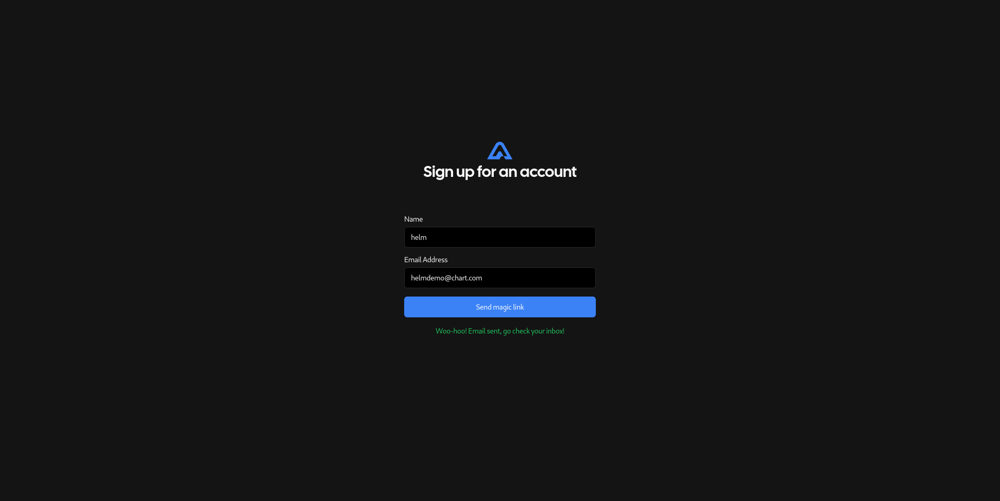
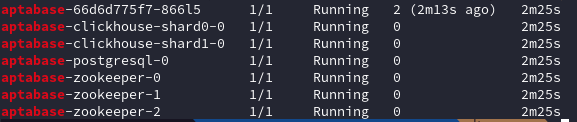
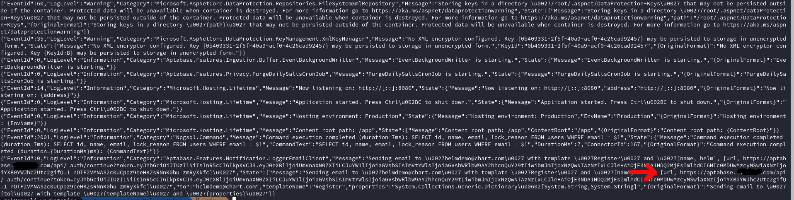
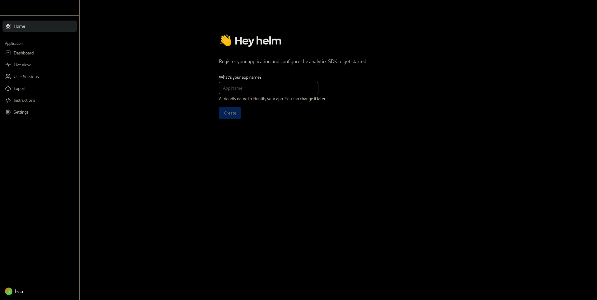

# Aptabase Helm Chart for Kubernetes
This guide will walk you through the step-by-step process to install the Aptadata Chart and launch the application.

## How to
1. Clone the repository  
   ```bash
   git clone https://github.com/Zakariasma/Helm-aptabase.git

2. Go to the directory
   ```bash
   cd Helm-aptabase/chart

4. Modify the values.yaml, the points to be changed are noted in the comments.

5. Run the following commands
   ```bash
   helm repo add bitnami https://charts.bitnami.com/bitnami
   ```

   ```bash
   helm repo update
   ```

   ```bash
   helm dependency update .
   ```

   ```bash
   helm install aptabase . -n <yourNamespace>
   ```


6. Once the pods are started, go to the specified ingress or to localhost by forwarding the port and create a new account.
   


7. Run 
 ```bash
 kubectl get pods -n <YourNamespace> | grep aptabase
 ```
 

1.  Select the Aptabase pod (aptabase-66d6d775f7-866l5 in my case), then enter the command. You will find the URL that you need to copy into the browser to activate the account (it starts at the red arrow):
    ```bash
    kubectl logs <PodName> -n <YourNamespace>
    ```
   

2.   Copy the URL and paste it into the browser.


   
